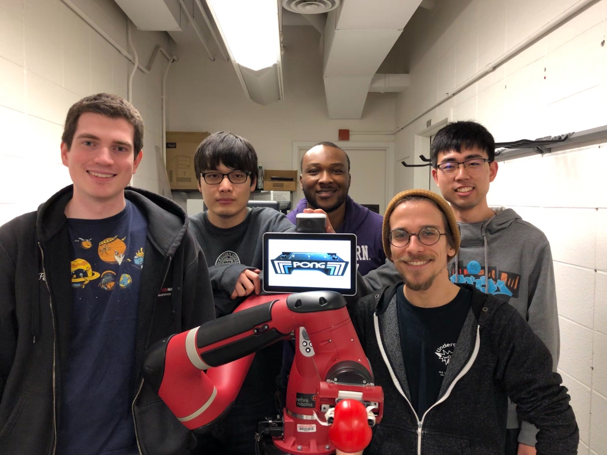

# ME495 Embedded Systems Final Project

#### *Virtual Pong with Sawyer*
#### *Group 5: Ethan Park, Victor Ozoh, Petras Swissler, Andrew Thompson, Evan Li*

### Overview

The purpose of this project was to develop an interactive game of Pong on Sawyer. This system includes ultrasonic distance sensors which detect the location of the two pong paddles (the users' hands). These locations are translated to our 'game coordinates' and subsequently implemented in our game logic to determine the trajectory of the ball. The ball, the rectangular game area, and the ball's trajectory are represented in Sawyer's world coordinate frame, and the arm will trace out these trajectories in response to the gameplay.

### Arm Control

##### armcontrolT node
Description: [armcontrolT.py](src/armcontrolT.py) is responsible for publishing the location of Sawyer's end-effector in the space frame and for subscribing to twists. Using these twists, the node also computes and sets Sawyer's joint velocities.

Subscribes to:
* `/pongvelocity` : this topic message takes the form of a `geometry_msgs/Twist`, with three linear velocities and three angular velocities.

Publishes to:
* `/endpoint_Pose` : this topic message takes the form of a `geometry_msgs/Pose`, with coordinate information in Cartesian position (x,y,z) as well as quaternion orientation (x,y,z,w).

The Twist and Pose messages used are both with respect to Sawyer's world frame. We use the `/intera_interface/Limb` class to store current joint angles of Sawyer (via `limb.joint_angles()`) and to set calculated joint velocities (via `limb.set_joint_velocities()`).

 The joint velocities are calculated by using `mr.Adjoint()` and `mr.JacobianSpace()` from the Modern Robotics Code Library (mr) as well as `np.linalg.pinv()` from NumPy (np). The pseudoinverse of the space Jacobian was dot multiplied with our end-effector Twist to find updated joint velocities.

### Pong logic

##### pong_MASTER node

Description: [pong_MASTER.py](src/pong_MASTER.py) is responsible for detecting impacts, calculating and publishing updated Twists, translating hand positions and ball position into the 'game space', and generating the GUI to illustrate the current game. It also includes modifiable parameters for ball_velocity and paddle_size (effectively allowing the user to choose their difficulty).

Subscribes to:
* `\endpoint_Pose` : see above.
* `\hand_positions` : this topic message takes the form of a custom `measured_distances` message, which consists of two int32s representing the right and left hand distances in millimeters.

Publishes to:
* `\pongvelocity` : see above.

The script begins by setting the arm to the game start position before 'serving' the ball with random x and y velocities. These velocities are normalized in order to maintain the ball's speed according to the configurable parameter mentioned above. We set the game boundary and use flags to keep track of contact between the ball and said boundaries. There is specific logic in place to prevent multiple impact updates during overshot (i.e., when the arm goes slightly past a boundary, caused by accumulated drift in the robotic arm).

If the ball position is greater than or equal to either of the left or right boundaries (entering the goal zones), and are not reflected by the players' paddles, a score is counted and the arm resets to its start position before beginning the next round. The maximum score is likewise configurable.

The GUI is illustrated by using the pyfiglet Python module, with relevant classes defined in [pong_classes.py](\src\pong_classes.py) and helper functions defined in [pong_plot.py](\src\pong_plot.py).

Support functions for resetting the hand to the default serving position are included in [hand_interface.py](\src\hand_interface.py).

### Hand Sensors

##### senseDistance.ino

##### sense_hands node

### How to run:

We consolidated our nodes into [pongTest.launch](\launch\pongTest.launch).
From the Sawyer workspace containing this package, run:

`roslaunch sawyer_pong pongTest.launch`

Configurable parameters can be edited in the launch file.
